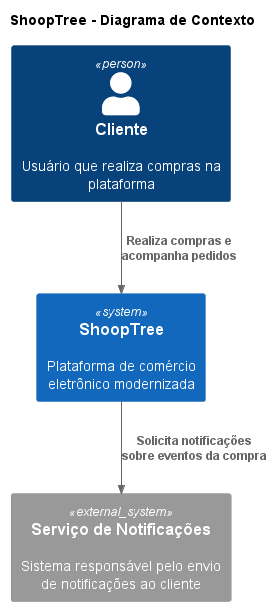
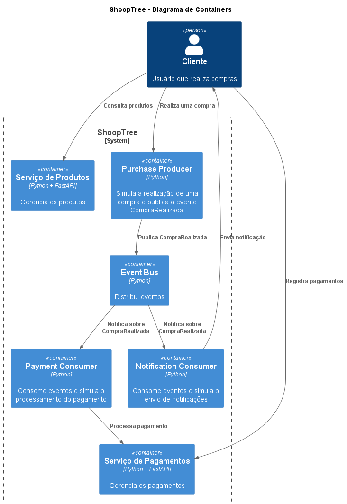

# ShoopTree --- Modernização Arquitetural

Projeto acadêmico desenvolvido para a disciplina de **Software
Architecture & Design Patterns**, com foco na análise e modernização
arquitetural do sistema ShoopTree.

A proposta combina a análise de um sistema monolítico com a
implementação de uma prova de conceito baseada em **serviços
independentes**, **comunicação orientada a eventos**, **FastAPI**,
**Event Bus** e aplicação do **Design Pattern Observer**.

------------------------------------------------------------------------

## 1. Visão geral

O trabalho foi dividido em duas grandes etapas:

### Etapa 1 --- Análise e decisão arquitetural

Nesta etapa foram realizados:

-   análise das características e limitações do monólito;
-   revisão dos principais conceitos de arquitetura de software;
-   comparação entre alternativas arquiteturais;
-   definição e justificativa da arquitetura escolhida;
-   elaboração de um **ADR (Architecture Decision Record)**;
-   fundamentação da escolha do **Design Pattern Observer**.

### Etapa 2 --- Prova de conceito

A segunda etapa materializa a decisão arquitetural por meio de:

-   organização do projeto em um repositório GitHub;
-   dois serviços FastAPI;
-   Serviço de Produtos;
-   Serviço de Pagamentos;
-   simulação de eventos;
-   Event Bus;
-   Purchase Producer;
-   Payment Consumer;
-   Notification Consumer;
-   aplicação do Observer Pattern;
-   dois diagramas C4;
-   documentação e instruções de execução.

------------------------------------------------------------------------

# 2. Análise arquitetural

## 2.1 Monólito

O sistema de origem é analisado como uma aplicação monolítica, na qual
diferentes responsabilidades ficam concentradas em uma mesma estrutura.

Esse modelo pode funcionar adequadamente enquanto o sistema é pequeno,
mas tende a apresentar dificuldades conforme o número de funcionalidades
e integrações cresce.

Entre os principais pontos observados estão:

-   maior acoplamento entre responsabilidades;
-   dificuldade de evolução independente de funcionalidades;
-   maior impacto de alterações em uma parte do sistema;
-   dificuldade de escalar somente os componentes que apresentam maior
    demanda;
-   maior risco de uma alteração introduzir efeitos colaterais em outras
    áreas;
-   necessidade de coordenar mudanças de diferentes responsabilidades em
    uma mesma aplicação.

A modernização proposta busca reduzir esses problemas sem exigir que
todo o sistema seja reconstruído de uma única vez.

------------------------------------------------------------------------

# 3. Conceitos de arquitetura considerados

Durante a análise foram considerados conceitos relacionados a:

-   arquitetura monolítica;
-   arquitetura em camadas;
-   microsserviços;
-   arquitetura orientada a eventos;
-   desacoplamento;
-   separação de responsabilidades;
-   comunicação síncrona;
-   comunicação assíncrona;
-   escalabilidade independente;
-   evolução incremental.

A solução implementada utiliza uma combinação de **serviços
independentes** e **comunicação orientada a eventos**.

------------------------------------------------------------------------

# 4. Comparação entre arquiteturas

## Monólito

### Vantagens

-   estrutura inicial mais simples;
-   desenvolvimento e execução centralizados;
-   menor complexidade operacional para sistemas pequenos.

### Desvantagens

-   maior acoplamento;
-   evolução independente limitada;
-   escalabilidade menos granular;
-   mudanças podem afetar diferentes funcionalidades da aplicação.

------------------------------------------------------------------------

## Arquitetura em camadas

### Vantagens

-   separação organizada das responsabilidades;
-   facilidade de compreensão;
-   boa alternativa para sistemas de menor complexidade.

### Desvantagens

-   não resolve necessariamente o acoplamento entre grandes módulos;
-   continua existindo uma unidade de implantação quando aplicada como
    uma única aplicação;
-   escalabilidade independente continua limitada.

------------------------------------------------------------------------

## Microsserviços

### Vantagens

-   separação de responsabilidades;
-   possibilidade de evolução independente;
-   possibilidade de implantação e escalabilidade independentes;
-   redução do acoplamento entre domínios.

### Desvantagens

-   maior complexidade;
-   necessidade de comunicação entre serviços;
-   maior necessidade de observabilidade e gerenciamento;
-   tratamento de falhas distribuídas.

------------------------------------------------------------------------

## Arquitetura orientada a eventos

### Vantagens

-   reduz o acoplamento entre produtor e consumidores;
-   permite que diferentes componentes reajam ao mesmo evento;
-   facilita a inclusão de novos consumidores;
-   favorece processamento assíncrono.

### Desvantagens

-   maior complexidade de rastreamento do fluxo;
-   necessidade de definir claramente os eventos;
-   tratamento de falhas e consistência pode se tornar mais complexo.

------------------------------------------------------------------------

# 5. Arquitetura escolhida

A solução proposta combina **serviços independentes** com uma abordagem
**orientada a eventos**.

A separação inicial contempla:

-   **Serviço de Produtos**;
-   **Serviço de Pagamentos**;
-   **Purchase Producer**;
-   **Event Bus**;
-   **Payment Consumer**;
-   **Notification Consumer**.

A escolha foi feita porque permite demonstrar, em uma prova de conceito
pequena, os principais benefícios buscados na modernização:

1.  separação de responsabilidades;
2.  menor acoplamento;
3.  evolução independente dos componentes;
4.  distribuição de eventos;
5.  possibilidade de múltiplos consumidores reagirem ao mesmo evento.

A implementação utiliza FastAPI para os serviços HTTP e Python para a
simulação do mecanismo de eventos.

------------------------------------------------------------------------

# 6. ADR --- Architecture Decision Record

## ADR-001 --- Modernização para serviços independentes com eventos

### Status

**Aceito**

### Contexto

O sistema monolítico concentra diferentes responsabilidades e pode
apresentar dificuldades de evolução, manutenção e escalabilidade
conforme cresce.

Era necessário definir uma abordagem que demonstrasse uma modernização
incremental, mantendo o escopo adequado para uma prova de conceito
acadêmica.

### Decisão

Adotar uma arquitetura baseada em serviços independentes, complementada
por comunicação orientada a eventos.

Os principais componentes da prova de conceito são:

-   Serviço de Produtos;
-   Serviço de Pagamentos;
-   Event Bus;
-   Purchase Producer;
-   Payment Consumer;
-   Notification Consumer.

### Consequências positivas

-   separação de responsabilidades;
-   redução do acoplamento;
-   possibilidade de evolução independente;
-   possibilidade de adicionar novos consumidores;
-   demonstração prática de arquitetura orientada a eventos.

### Consequências negativas

-   aumento da complexidade arquitetural;
-   necessidade de gerenciar comunicação entre componentes;
-   necessidade de mecanismos adicionais para observabilidade e
    tratamento de falhas em uma implementação de produção.

### Escopo da prova de conceito

Para manter o trabalho simples e reproduzível, o Event Bus é simulado em
Python. Não foi adotado um broker externo de mensagens.

------------------------------------------------------------------------

# 7. Design Pattern --- Observer

O **Observer Pattern** foi escolhido para fundamentar a distribuição dos
eventos.

O padrão permite que um objeto mantenha uma lista de observadores e os
notifique quando ocorre uma mudança ou evento.

Na implementação:

  Papel do Observer           Componente
  --------------------------- --------------------------
  Subject                     `EventBus`
  Observers                   consumidores registrados
  Evento                      `CompraRealizada`
  Consumidor de pagamento     `Payment Consumer`
  Consumidor de notificação   `Notification Consumer`

O produtor da compra não precisa conhecer diretamente cada consumidor.

O fluxo é:

``` text
Purchase Producer
       |
       | publica CompraRealizada
       v
    Event Bus
       |
       +----------------------+
       |                      |
       v                      v
Payment Consumer      Notification Consumer
       |                      |
       v                      v
Processamento           Notificação
```

Essa abordagem permite que um novo consumidor seja acrescentado ao
mecanismo de eventos sem que o produtor precise ser alterado
diretamente.

------------------------------------------------------------------------

# 8. Estrutura do projeto

``` text
shooptree-modernization/
│
├── diagrams/
│   ├── c4-context.puml
│   ├── c4-context.png
│   ├── c4-container.puml
│   └── c4-container.png
│
├── docs/
│
├── events/
│   ├── event_bus.py
│   ├── main.py
│   ├── notification_consumer.py
│   ├── payment_consumer.py
│   └── producer.py
│
├── pagamento_service/
│   └── main.py
│
├── produto_service/
│   └── main.py
│
├── .gitignore
└── README.md
```

------------------------------------------------------------------------

# 9. Serviço de Produtos

O **Serviço de Produtos** foi implementado com Python e FastAPI.

Sua responsabilidade é disponibilizar operações relacionadas aos
produtos.

## Endpoints

  Método   Endpoint      Função
  -------- ------------- ------------------
  GET      `/produtos`   Lista produtos
  POST     `/produtos`   Cadastra produto

## Porta

``` text
8001
```

## Exemplo de produto

``` json
{
  "id": 1,
  "nome": "Notebook",
  "preco": 4500.00
}
```

A API pode ser testada pela documentação interativa do FastAPI em:

``` text
http://127.0.0.1:8001/docs
```

------------------------------------------------------------------------

# 10. Serviço de Pagamentos

O **Serviço de Pagamentos** foi implementado com Python e FastAPI.

Sua responsabilidade é representar o processamento relacionado aos
pagamentos.

## Endpoints

  Método   Endpoint        Função
  -------- --------------- --------------------
  GET      `/pagamentos`   Lista pagamentos
  POST     `/pagamentos`   Cadastra pagamento

## Porta

``` text
8002
```

A documentação interativa pode ser acessada em:

``` text
http://127.0.0.1:8002/docs
```

------------------------------------------------------------------------

# 11. Simulação de eventos

A comunicação orientada a eventos é demonstrada por meio dos componentes
localizados em `events/`.

## Purchase Producer

O `Purchase Producer` representa a realização de uma compra.

Após a compra, é publicado o evento:

``` text
CompraRealizada
```

## Event Bus

O `Event Bus` recebe o evento e o distribui aos consumidores
interessados.

## Payment Consumer

O `Payment Consumer` recebe o evento `CompraRealizada` e simula o
processamento do pagamento.

## Notification Consumer

O `Notification Consumer` recebe o mesmo evento e simula o envio de uma
notificação ao cliente.

------------------------------------------------------------------------

# 12. Fluxo completo da compra

O fluxo demonstrado na prova de conceito é:

``` text
Cliente
   |
   v
Purchase Producer
   |
   | CompraRealizada
   v
Event Bus
   |
   +-----------------------+
   |                       |
   v                       v
Payment Consumer     Notification Consumer
   |                       |
   v                       v
Pagamentos            Notificação
```

Durante a execução da simulação foi obtido um fluxo equivalente a:

``` text
Compra realizada: pedido 1001

Evento publicado: CompraRealizada

Pagamento recebido para o pedido 1001: R$ 4500.00

Pagamento processado com sucesso.

Notificação enviada para o cliente do pedido 1001.
```

Esse resultado demonstra que um único evento pode provocar reações
independentes em diferentes consumidores.

------------------------------------------------------------------------

# 13. Diagramas C4

A documentação arquitetural utiliza dois níveis do modelo C4.

## 13.1 C4 --- Contexto

O diagrama de contexto representa o sistema ShoopTree, o cliente e o
serviço externo relacionado às notificações.



Arquivo-fonte:

``` text
diagrams/c4-context.puml
```

------------------------------------------------------------------------

## 13.2 C4 --- Containers

O diagrama de containers apresenta os principais componentes internos da
prova de conceito.

Entre eles:

-   Serviço de Produtos;
-   Serviço de Pagamentos;
-   Event Bus;
-   Payment Consumer;
-   Notification Consumer;
-   Purchase Producer.



Arquivo-fonte:

``` text
diagrams/c4-container.puml
```

------------------------------------------------------------------------

# 14. Como executar

## 14.1 Pré-requisitos

É necessário possuir:

- **Python** instalado;
- **Git** instalado;
- **VS Code** ou outro editor de código;
- acesso ao repositório do projeto.

---

## 14.2 Clonar o repositório

Caso o projeto ainda não esteja disponível localmente, clone o repositório:

```powershell
git clone https://github.com/allan-berbert/shooptree-modernization.git
cd shooptree-modernization
```

> O ambiente virtual `.venv` não faz parte do repositório. Ele deve ser criado localmente após o projeto ser clonado.

---

## 14.3 Criar o ambiente virtual

Na raiz do projeto, crie um novo ambiente virtual:

```powershell
python -m venv .venv
```

Esse comando cria a pasta `.venv` localmente no computador.

---

## 14.4 Ativar o ambiente virtual

No Windows PowerShell:

```powershell
.\.venv\Scripts\Activate.ps1
```

Após a ativação, o terminal deverá apresentar `(.venv)` no início da linha de comando.

---

## 14.5 Instalar as dependências

Com o ambiente virtual ativado, instale as bibliotecas utilizadas pelos serviços FastAPI:

```powershell
pip install fastapi uvicorn
```

---

## 14.6 Executar o Serviço de Produtos

Em um terminal com o ambiente virtual ativado:

```powershell
cd .\produto_service
uvicorn main:app --reload --port 8001
```

A documentação interativa da API pode ser acessada em:

```text
http://127.0.0.1:8001/docs
```

---

## 14.7 Executar o Serviço de Pagamentos

Abra outro terminal, ative o ambiente virtual e retorne à raiz do projeto:

```powershell
.\.venv\Scripts\Activate.ps1
cd .\pagamento_service
uvicorn main:app --reload --port 8002
```

A documentação interativa da API pode ser acessada em:

```text
http://127.0.0.1:8002/docs
```

---

## 14.8 Executar a simulação de eventos

Abra outro terminal e ative o ambiente virtual:

```powershell
.\.venv\Scripts\Activate.ps1
```

A partir da raiz do projeto:

```powershell
cd .\events
python main.py
```

O terminal deverá apresentar as etapas da compra, publicação do evento, processamento do pagamento e envio da notificação.

---

## 14.9 Resumo das portas utilizadas

| Serviço | Porta | Documentação |
|---|---:|---|
| Serviço de Produtos | 8001 | `http://127.0.0.1:8001/docs` |
| Serviço de Pagamentos | 8002 | `http://127.0.0.1:8002/docs` |
| Simulação de Eventos | — | Execução pelo terminal |


------------------------------------------------------------------------

# 15. Testes realizados

A prova de conceito foi validada por meio da documentação interativa das
APIs e da execução da simulação de eventos.

## Produtos

-   execução do `GET /produtos`;
-   execução do `POST /produtos`;
-   verificação dos dados retornados pela API.

## Pagamentos

-   execução do serviço FastAPI;
-   disponibilização dos endpoints;
-   simulação do processamento de pagamento por meio do consumidor de
    eventos.

## Eventos

Foi executada uma compra simulada utilizando o pedido `1001` e valor de
`R$ 4500,00`.

O fluxo confirmou:

1.  realização da compra;
2.  publicação de `CompraRealizada`;
3.  recebimento do evento pelo consumidor de pagamentos;
4.  processamento simulado do pagamento;
5.  recebimento do evento pelo consumidor de notificações;
6.  envio simulado da notificação.

------------------------------------------------------------------------

# 16. Git e GitHub

O projeto foi versionado utilizando Git e disponibilizado em um
repositório GitHub.

O fluxo utilizado durante o desenvolvimento foi:

``` powershell
git init
git status
git add .
git commit -m "Mensagem do commit"
git push
```

A branch principal utilizada é:

``` text
main
```

O projeto foi organizado em commits para registrar a evolução da
implementação e da documentação.

------------------------------------------------------------------------

# 17. Tecnologias utilizadas

-   **Python** --- implementação dos serviços e da simulação de eventos;
-   **FastAPI** --- criação das APIs dos serviços;
-   **Uvicorn** --- execução das aplicações FastAPI;
-   **PlantUML** --- criação dos diagramas;
-   **C4-PlantUML** --- representação arquitetural utilizando o modelo
    C4;
-   **Git** --- controle de versão;
-   **GitHub** --- hospedagem do repositório.

------------------------------------------------------------------------

# 18. Relação entre análise e implementação

A implementação foi construída para materializar as decisões tomadas
durante a análise arquitetural.

  Decisão                                        Implementação
  ---------------------------------------------- -----------------------------------
  Separação de responsabilidades                 Serviços de Produtos e Pagamentos
  Comunicação HTTP                               APIs FastAPI
  Comunicação orientada a eventos                Event Bus
  Desacoplamento entre produtor e consumidores   `CompraRealizada`
  Distribuição de eventos                        Event Bus
  Observer Pattern                               Event Bus + Consumers
  Documentação arquitetural                      Diagramas C4
  Registro das decisões                          ADR
  Reprodutibilidade                              README + Git

------------------------------------------------------------------------

# 19. Limitações da prova de conceito

A implementação tem finalidade acadêmica e representa uma simplificação
de uma arquitetura que, em um ambiente de produção, exigiria componentes
adicionais.

Entre as limitações estão:

-   o Event Bus é simulado em Python;
-   não há broker externo de mensagens;
-   não há banco de dados persistente;
-   não há autenticação ou autorização;
-   não há infraestrutura de observabilidade distribuída;
-   não são implementados mecanismos completos de retry, dead-letter
    queue ou garantia de entrega.

Essas simplificações permitem demonstrar os conceitos arquiteturais
fundamentais sem introduzir infraestrutura adicional ao projeto.

------------------------------------------------------------------------

# 20. Conclusão

A modernização proposta demonstra como um sistema inicialmente
monolítico pode ser reorganizado em componentes com responsabilidades
mais bem definidas.

A separação entre Produtos e Pagamentos reduz o acoplamento funcional,
enquanto o uso de eventos permite que diferentes consumidores reajam a
uma mesma ação de negócio.

A aplicação do **Observer Pattern** fornece a base conceitual para a
distribuição das notificações, e os diagramas C4 documentam a solução em
diferentes níveis de abstração.

Dessa forma, a prova de conceito conecta a análise arquitetural, a
decisão registrada no ADR, a aplicação do Design Pattern e a
implementação prática em Python/FastAPI.

---

# 21. DELETE — Produtos — FUNÇÃO ADICIONAL

Além das operações de consulta e cadastro, o Serviço de Produtos possui um endpoint para remoção dos produtos armazenados em memória.


---

# 22. Exemplo concreto de solução existente

Um exemplo de aplicação de uma arquitetura baseada em serviços independentes e comunicação orientada a eventos é a **Amazon**.

A plataforma utiliza serviços independentes para diferentes responsabilidades e mecanismos de comunicação orientados a eventos para integrar funcionalidades, permitindo que componentes sejam desenvolvidos, escalados e atualizados de forma independente.

Essa abordagem apresenta similaridades com a proposta de modernização da ShoopTree, especialmente na separação de responsabilidades e na utilização de eventos para permitir que diferentes componentes reajam a uma mesma ação de negócio.

---